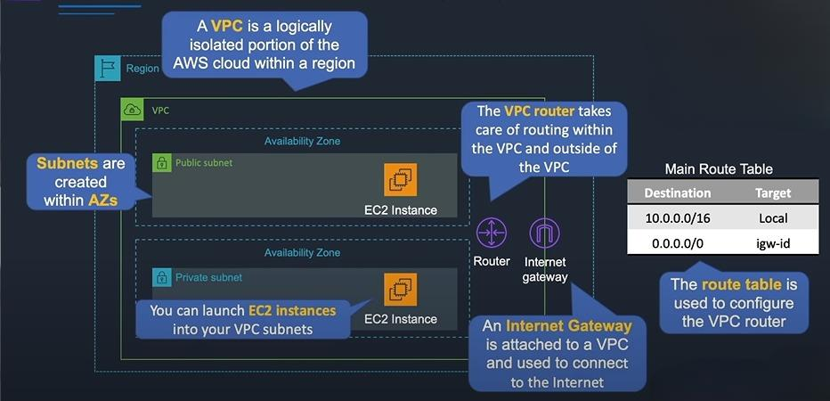
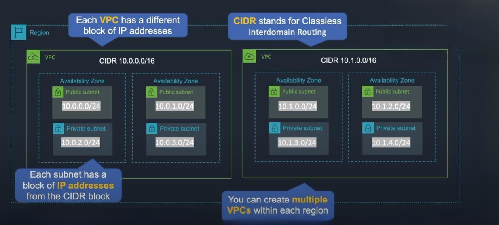

# AWS

 Guía de Introducción y Configuración de VPC en AWS

1. [Introducción](#introducción)
2. [Primeros Pasos con la Dirección IPv4](#primeros-pasos-con-la-dirección-ipv4)
3. [Descripción General de Amazon VPC](#descripción-general-de-amazon-vpc)
4. [Definición de Bloques CIDR para VPC](#definición-de-bloques-cidr-para-vpc)
5. [Asistente de VPC](#asistente-de-vpc)
6. [Crear una VPC Personalizada con Subredes](#crear-una-vpc-personalizada-con-subredes)
7. [Lanzar Instancias y Probar la VPC](#lanzar-instancias-y-probar-la-vpc)
8. [Grupos de Seguridad y Listas de Control de Acceso de Red (NACL)](#grupos-de-seguridad-y-listas-de-control-de-acceso-de-red-nacl)
9. [Configurar Grupos de Seguridad y NACL](#configurar-grupos-de-seguridad-y-nacl)
10. [Interconexión de VPC en Amazon](#interconexión-de-vpc-en-amazon)
11. [Configurar Interconexión de VPC](#configurar-interconexión-de-vpc)
12. [Puntos de Enlace de VPC](#puntos-de-enlace-de-vpc)
13. [Crear un Punto de Enlace de VPC](#crear-un-punto-de-enlace-de-vpc)
14. [AWS Client VPN](#aws-client-vpn)
15. [VPN de Sitio a Sitio en AWS](#vpn-de-sitio-a-sitio-en-aws)
16. [Hub de Nube VPN de AWS](#hub-de-nube-vpn-de-aws)
17. [AWS Direct Connect (DX)](#aws-direct-connect-dx)
18. [Pasarela de AWS Direct Connect](#pasarela-de-aws-direct-connect)
19. [AWS Transit Gateway](#aws-transit-gateway)
20. [Uso de IPv6 en una VPC](#uso-de-ipv6-en-una-vpc)
21. [Crear Registros de Flujo de VPC](#crear-registros-de-flujo-de-vpc)

## Introducción
Esta sección proporciona una visión general y una introducción a los servicios de AWS cubiertos en esta guía.

## Primeros Pasos con la Dirección IPv4

Dirección IP: Una dirección IP es una dirección única que identifica a un dispositivo en Internet o en una red local. IP significa “protocolo de Internet”.

Ejemplo: Digamos que tenemos un servidor web en Internet y deseas comunicarse con ese servidor web. Ahora es problable que el servidor web tenga algun tipo de interfaz de red y conectada a esa insterfaz de red habrá una dirección IP (esto será una dirección IP pública). Las direcciones IP son las direcciones que las computadoras utilizan para comunicarse entre sí. Entonces tienes tu computadora en casa y tienes un navegador web abierto, y escribes http://example.com. Recordemos que las computadoras se comunican mediante direcciones IP, entonces aquí es donde entra en juego un sitema de nombre de domino o un servidor DNS.

Su computadora se comunica´ra con un servidor DNS, y le preguntará al servidor DNS cual es la dirección IP. Una vez que la computadora tenga el resultado, podra comunicarse al servidor web usando la dirección IP.

Direccion IP:

Cada una de estas partes entre los puntos es en realidad un octeto binario. Pero que es un octeto binario: 

Un octeto significa que tiene ocho valores, y esos valores pueden ser un 1 o un 0 (binario). 

ID de red y ID de host: Como podemos ver en la imagen anterior los primeros 3 octetos representan el ID de red (Network ID), este valor será el mismo para todas las compuatadoras en esta red. El ID del host será único para cada ordenador de esta red. Cada dirección IP tendrá una red y un ID de host pero la forma de configurarlos varía.

Mascara de subred: Es un número binario que se utiliza junto con una dirección IP para dividir una red IP en subredes más pequeñas. Su función principal es definir qué parte de la dirección IP pertenece a la red y qué parte se reserva para identificar hosts específicos dentro de esa red.

En este caso tenemos 255 (en binarios sería 11111111), basicamente tenemos un bit que es 1 que representa el ID de la red, entonces aquí tenemos 8 bits que son 1, 8 bits que son 1 y 8 bits que son 1, por lo que esos primeros octetos libres represan el ID de la red. Entonces el ultimo octeto en el cuadro naranja aquí será el ID del host, por eso es 0. Entonces, cada bit de la máscara de subred que es 0, significa que ahí es donde tenemos valores a los que se les puede asignar un host. Y cada bit que es 1, esos son valores que serán exactamente los mismo para todas las computadoras en la red. 

Por lo tanto, una máscara de subred es una forma sencilla de ver qué bit es la red y qué parte es el ID del host. 

Ejemplo: Tenemos nuetra red 192.168.0.0 con una mascara de subred. Ahora los primeros 3 octetos de la mascara representan 24 bits, una mascara de subred de 24 bits porque tenemos ocho unos en esos primeros tres octetos (255 en binario es 11111111). Una forma de representar la máscara de subred seria de esta forma 192.168.0.0/24, la IP y los 24 bits que esto es la suma de los 3 octetos. 

En una red es posible que tengamos varios ordenadores, y podemos ver en la imagen anterior que cada uno tiene diferentes ID de host, pero es la misma ID de red para todas. En este caso, los ID de host son 1,2,3,4,5 y 6 y el ID de red es 192.168.0

Clases con Direcciones IP:

## Descripción General de Amazon VPC

Nube privada virtual o VPC de Amazon: Una VPC es esencialmente una porción lógicamente aislada de la nube de AWS que luego puede usar para implementar sus recursos dentro de ella, y eso es diferente al espacio público fuera de la VPC, donde se configura servicios como Amazon s3. Este es un espacio privado y usted tiene control total sobre cómo configurar su VPC. Dentro de una región tenemos zonas de disponibilidad y puede usarlas dentro de su VPC creando subredes y asignándolas a una zona de disponibilidad.

Una subred siempre se asigna a una zona de disponibilidad y no puede abarcar varios AZs. Pero puede tener varias subredes en la misma zona de disponiblidad y luego implementar nuestro recursos, como dos instancias sencillas en nuestras subredes. 

Exsite algo llamado enrutados VPC, realmente no ves el enrutador VPC, pero existe e interactuamos con él configurando tablas de rutas. 

El enrutador VPC se encarga de todo el enrutamiento de las conexiones que salen de una subred. Si envías datos desde una subred, tiene que ir a otro lugar, tal vez a otra subred, otal vez a Internet o a alguna otra red. Entonces el enrutador se encarga de asegurarse de que la conexión de datos se envíe al lugar correcto. 

No ves el enrutador VPC, todo lo que debe hacer es ver las tablas de rutas y ellas configurarán el enrutador VPC por usted. Por lo tanto, debemos especificar los destinos y los objetos para ciertas redes y así es como sabe dónde enviar esos intentos de conexión. Si queremos acceder a Internt, también necesitamos una puerta de enlace de Internet, la puerta de Internet está conectada a su VPC, solo tiene una por VPC. La puerta de enlace de Internet se utiliza para enviar datos a Internet. Eso es tráfico de salida, y desde Internet, ese es el tráfico de Ingrees. Y configuramos nuestras tablas de rutas con una ruta al IP de la puerta de enlace de Internet, que le indica que envíe todo el tráfico que no se ajusta a una de las redes en la tabla de rutas anterior a la puerta de enlace de Internet. 

Puedes crear varias VPC dentro de una región, tienes un límite predeterminado de cinco, pero puedes solicitar un aumento en esa cantidad. Cada VPC tiene un bloque de direcciones IP. Ese es el bloque general de direcciones a partir del cual luego creas las direcciones que asignas a tus subredes. Es una especie de bloque maestro de direcciones. Cada VPC tiene una diferente de estas. Entonces, en este caso, tenemos dos VPC, y tienen diferentes bloque de direcciones IP. 

| Componente                     | Descripción                                                                           |
|-------------------------------|---------------------------------------------------------------------------------------|
| Virtual Private Cloud (VPC)    | Una red virtual aislada en la nube de AWS que puedes personalizar según tus necesidades.|
| Subnet                        | Una división lógica de una VPC que define un rango específico de direcciones IP.       |
| Internet Gateway              | Un componente que permite la conectividad de la VPC con Internet.                       |
| Egress-only Internet Gateway  | Proporciona conectividad de salida para tráfico IPv6 desde instancias en una VPC.      |
| Router                        | Gestiona el tráfico entre subredes dentro de una VPC y entre la VPC y redes externas.   |
| Peering Connection            | Una conexión entre dos VPC que permite el tráfico directo entre ellas.                  |
| VPC Endpoints                 | Puntos de conexión que permiten el acceso a servicios AWS desde una VPC sin pasar por Internet.|
| NAT Instance                  | Una instancia configurada como puerta de enlace para permitir acceso a Internet a instancias en subredes privadas.|
| NAT Gateway                   | Un servicio gestionado que proporciona conectividad de salida a instancias en subredes privadas.|
| Virtual Private Gateway       | Permite la conexión entre una VPC y una red local mediante una VPN.                      |
| Customer Gateway              | Representa el dispositivo de red en el extremo del cliente de una conexión VPN.          |
| AWS Direct Connect            | Un servicio que establece una conexión dedicada entre la infraestructura local y AWS.    |
| Security Group                | Un conjunto de reglas de seguridad que controla el tráfico de red hacia instancias.      |
| Network ACL                   | Lista de control de acceso que controla el tráfico de red a nivel de subred en una VPC.  |

## Definición de Bloques CIDR para VPC
Aprender a definir y gestionar bloques CIDR dentro de tu VPC.

## Asistente de VPC
Descubrir la herramienta Asistente de VPC para una configuración simplificada de VPC.

## Crear una VPC Personalizada con Subredes
Guía para crear una VPC personalizada con subredes especificadas.

## Lanzar Instancias y Probar la VPC
Instrucciones paso a paso para lanzar instancias y probar la configuración de tu VPC.

## Grupos de Seguridad y Listas de Control de Acceso de Red (NACL)
Comprender e implementar grupos de seguridad y listas de control de acceso de red para una seguridad mejorada.

## Configurar Grupos de Seguridad y NACL
Pasos detallados para la configuración de grupos de seguridad y listas de control de acceso de red.

## Interconexión de VPC en Amazon
Conocer la interconexión de VPC y sus casos de uso.

## Configurar Interconexión de VPC
Guía sobre cómo configurar las conexiones de interconexión de VPC.

## Puntos de Enlace de VPC
Comprender y configurar puntos de enlace de VPC.

## Crear un Punto de Enlace de VPC
Instrucciones paso a paso para crear un punto de enlace de VPC.

## AWS Client VPN
Configuración de AWS Client VPN para una comunicación segura.

## VPN de Sitio a Sitio en AWS
Configurar conexiones de VPN de sitio a sitio en AWS.

## Hub de Nube VPN de AWS
Aprender sobre la arquitectura y la implementación del Hub de Nube VPN de AWS.

## AWS Direct Connect (DX)
Comprensión y configuración de AWS Direct Connect.

## Pasarela de AWS Direct Connect
Explorar las capacidades y la configuración de la Pasarela de AWS Direct Connect.

## AWS Transit Gateway
Aprender sobre AWS Transit Gateway y su uso en arquitecturas de red.

## Uso de IPv6 en una VPC
Guía sobre cómo incorporar IPv6 dentro de tu VPC.

## Crear Registros de Flujo de VPC
Configuración de Registros de Flujo de VPC para capturar y analizar el tráfico de red.
